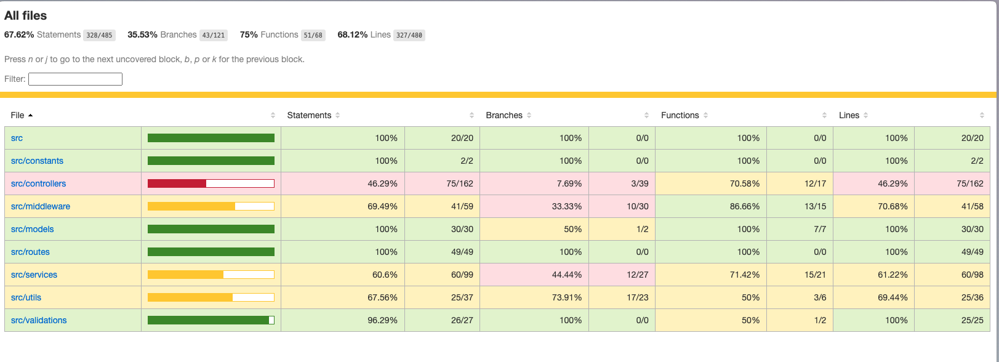

## Project Structure

```
fiverr-dushyant/
├── src/
│   ├── constants - error constants
│   ├── controllers - controller layers inherits from baseController for each module
│   ├── middleware - middleware for request validation, database validation, error handler and getProfile
│   ├── models - original model file has been split into multiple models for seperation of concern
│   ├── routes - routes for all the modules
│   ├── services - service layer extends from baseService for each module
│   ├── utils - helper functions for logging and responses(error, success)
│   ├── validations - joi validations for request schema
│   ├── app.js - express layer to initialise all the routes
│   └── server.js - init file
├── tests - unit tests
├── scripts - database seeding script
├── API_COLLECTION.postman_collection.json - API Collection with Examples and Documentation
```

## Project Overview

This project implements a backend API for a job platform where contractors can be paid for their jobs. The main entities in the system are Profiles (which can be either clients or contractors), Contracts, and Jobs.

### Key Components:

1. **Models**: Defined using Sequelize, representing the database schema.
2. **Controllers**: Handle HTTP requests and responses.
3. **Services**: Contain the business logic and interact with the models.
4. **Routes**: Define the API endpoints and link them to controllers.
5. **Middleware**: Includes authentication and request validation.
6. **Utils**: Contain helper functions for responses, logging, and validations.

### Main Features:

1. Profile management (clients and contractors)
2. Contract management
3. Job management including payment processing
4. Balance management for clients
5. Admin functionalities for best profession and best clients

## API Endpoints

1. **Profiles**
   - GET /profiles/:id
   - POST /profiles/balances/deposit/:id

2. **Contracts**
   - GET /contracts/:id
   - GET /contracts

3. **Jobs**
   - GET /jobs/unpaid
   - POST /jobs/:job_id/pay
   - GET /jobs
   - POST /jobs
   - PUT /jobs/:id
   - DELETE /jobs/:id

4. **Admin**
   - GET /admin/best-profession?start=<date>&end=<date>
   - GET /admin/?start=<date>&end=<date>&limit=<integer>

## Testing

The project includes unit tests and API tests. To run the tests:

```
npm run test
```

To generate a test coverage report:

```
npm run test:coverage
```

## Running the Project

1. Install dependencies: `npm install`
2. Seed the database: `npm run seed`
3. Start the server: `npm start`

The server will run on `http://localhost:3001` by default.

## Additional Notes

- The project uses SQLite as the database, with Sequelize as the ORM.
- Authentication is handled via the `getProfile` middleware.
- Request validation is implemented using Joi.
- Error handling is centralized and consistent across the application.


## Test Coverage
